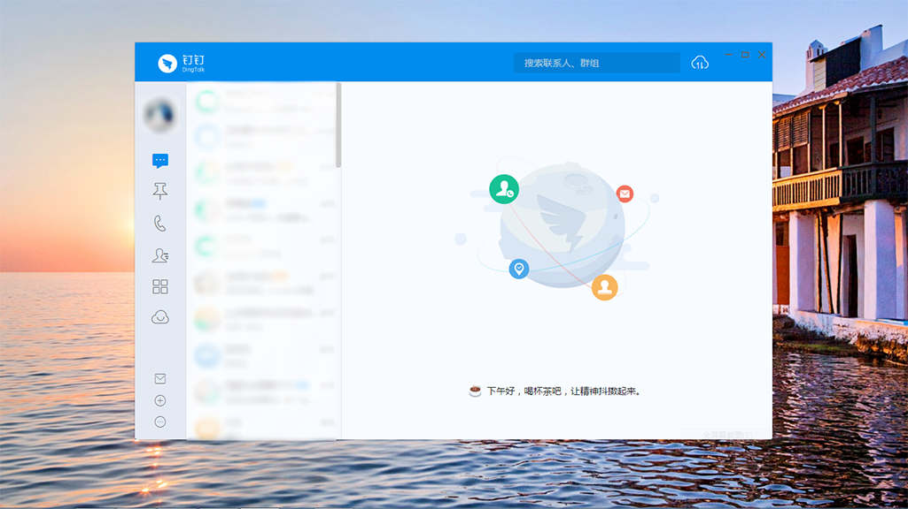
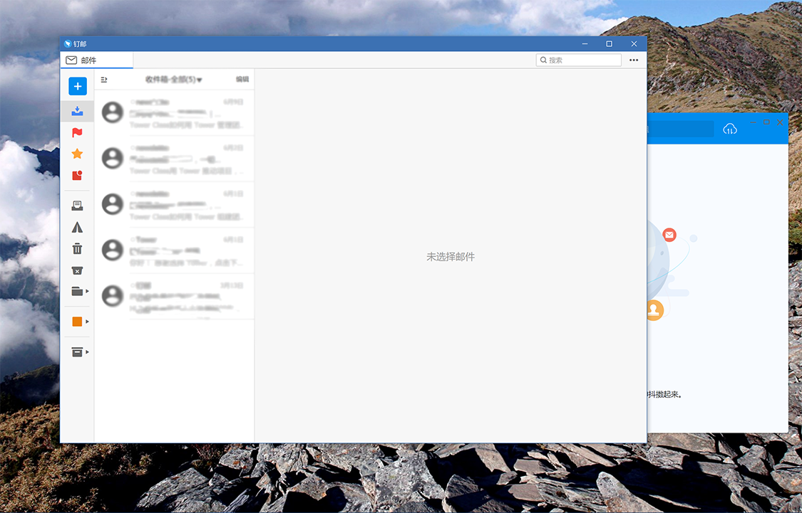
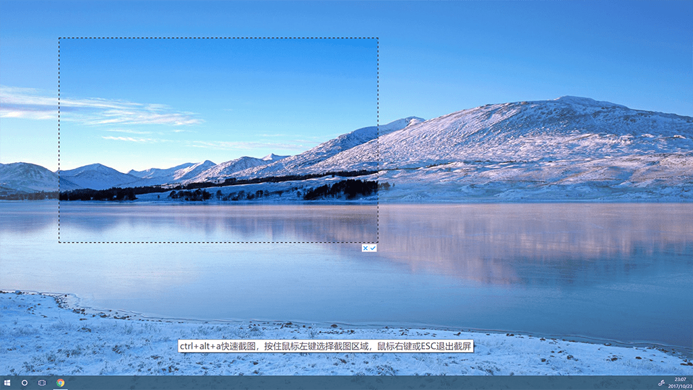
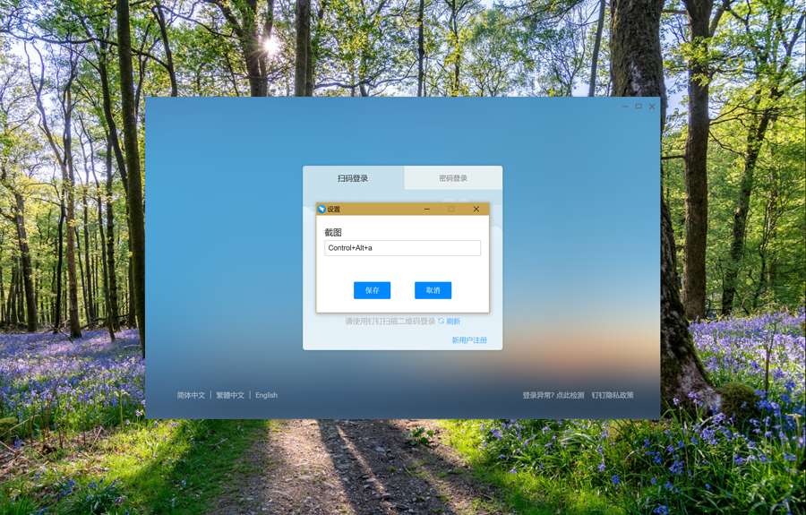
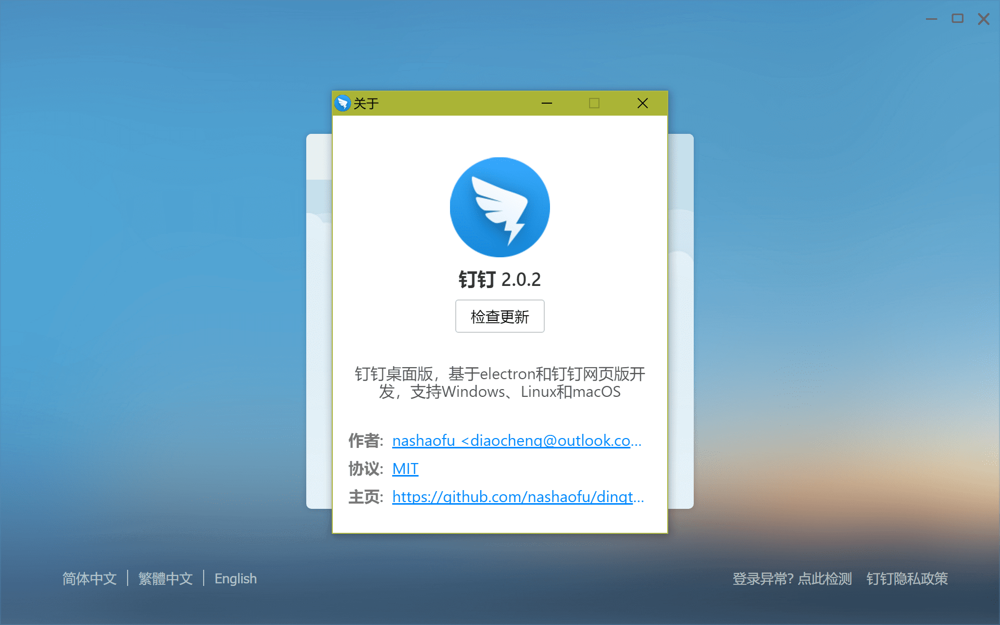

# dingtalk[](https://travis-ci.org/nashaofu/dingtalk)[](https://ci.appveyor.com/project/nashaofu/dingtalk/branch/master)
钉钉桌面版，基于electron和钉钉网页版开发，支持Windows、Linux和macOS

## 安装步骤
> 直接从[GitHub releases](https://github.com/nashaofu/dingtalk/releases/latest)页面下载最新版安装包即可

## 国内仓库与版本安装包
* 国内git地址：[https://gitee.com/nashaofu/dingtalk](https://gitee.com/nashaofu/dingtalk)
* 安装包：[https://pan.baidu.com/s/12pM3fi5nphCdgGH9WAnXvw](https://pan.baidu.com/s/12pM3fi5nphCdgGH9WAnXvw)

### 特别说明，提issue请尽量到[GitHub](https://github.com/nashaofu/dingtalk)，分别处理多个仓库实在精力有限

## 手动构建
```bash
# 安装依赖
# linux系统构建rpm请运行如下命令，否则可能会打包失败
# sudo apt-get -qq update
# sudo apt-get install --no-install-recommends -y gcc-multilib g++-multilib
# sudo apt-get install --no-install-recommends -y rpm

npm install

# 打包源码
npm run build

# 生成安装包
npm run pack
```

## 贡献指南
非常欢迎有兴趣的小伙伴一起来贡献力量，我写了一份很简单的[贡献指南](./CONTRIBUTING.md)，希望能帮助你快速上手

## 截图效果
1. 二维码登录页面

2. 账号密码登录页面

3. 登录后页面展示

4. 邮箱打开效果

5. 截图效果预览

6. 网络错误页面

7. 系统设置界面

8. 关于界面


## 功能说明
1. 本版本是基于网页版钉钉和electron制作的
2. 本版本与网页版的区别
    * 解决了网页版钉钉内容区域无法最大化的问题
    * 除了少数的功能未能够完全实现，其余的使用体验和PC版钉钉基本一致
3. 支持屏幕截图，并且支持多显示器截图。截图快捷键为`ctrl+alt+a`
4. 添加应用分类，[Linux系统分类](https://specifications.freedesktop.org/menu-spec/latest/apa.html#main-category-registry)
5. 目前已经支持Linux、macOS和Windows三个平台

## 更新说明
1. 支持屏幕截图，并且支持多显示器截图。截图快捷键为`ctrl+alt+a`，2017-10-23
2. 支持网络错误页面提示，网络恢复自动跳转到登陆页面，2017-12-28
3. 修改网络错误页面，支持快捷键设置，2018-02-07
4. 更新截图功能，支持多显示器截图，目前确认支持Ubuntu16，Ubuntu17不支持，其他Linux系统未测试，其中使用了[shortcut-capture](https://github.com/nashaofu/shortcut-capture)模块来实现截图；修复设置页面不修改快捷键时，点击保存时提示错误的BUG，2018-03-03
5. 整个项目采用webpack打包，采用electron-builder来构建应用，分别构建生成三大平台安装包，2018-03-22
6. 添加关于页面，文件下载进度支持，消息提示不弹出问题修复，修复Linux更新问题，2018-04-01
7. 修复消息提示node-notifier图标显示问题，2018-04-07
8. 修改消息提示太多不能关闭导致卡顿问题，支持rpm打包，升级截图工具，2018-05-30
9. 修复视频点击之后页面跳转问题，支持一下Mac，升级一下electron，2018-08-13

## TODO
- [x] 支持网络断开时显示错误页
- [x] 添加关于页面
- [x] 消息提示在windows上不出来的BUG，或者替换为node-notifier模块
- [x] windows弹出下载提示问题
- [ ] 邮箱打不开问题

## 关于支持加密信息的说明
加密信息暂不支持，详情请看[企业信息加密相关](https://github.com/nashaofu/dingtalk/issues/2)，也欢迎各位朋友能够去研究一下，帮助实现这个功能

## 打赏
如果你觉得作者的辛苦付出有帮助到你，你可以给作者买杯咖啡！🤣

